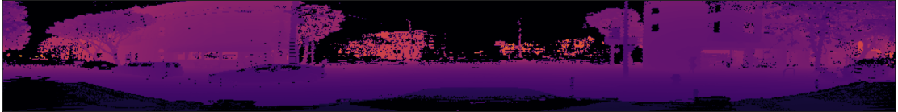
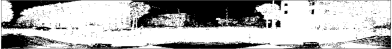
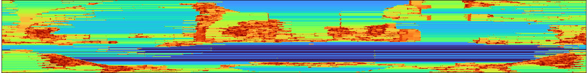
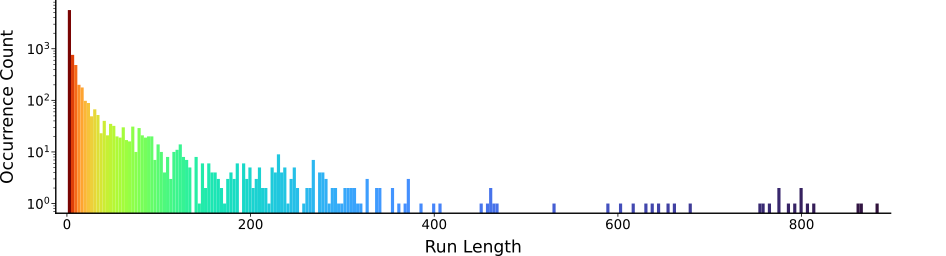

## I. A Context for the Problem

Secret Agent 00111 has emerged from retirement, drawn back into the covert underworld for one final mission. Robot cars have cut their mechanical ties and are running loose in cities across America, wreaking unprecedented autonomous havoc. With the fate of humanity once again on the line, Agent 00111 may be the only man capable of returning these rogue automata to their low-bandwidth leash.

Recent advances in high-resolution lidar have provided robots with remarkable new faculties for sensing their environment, but the resulting onslaught of lidar data has swamped the global robot surveillance network, rendering terabytes of robot activity invisible to their human handlers.

Senior case officers working out of the Pittsburgh field office have developed a compression algorithm for lidar data.
By converting lidar point clouds to range images, they are using techniques from lossless image and video compression to regain control over the growing robot swarms.

A declassified report from the signals intelligence (SIGINT) group has demonstrated excellent early progress, but one piece of the puzzle remains unsolved.
Lidar sensors produce out-of-range measurements whenever the lidar beam hits a surface that is too close or too far from the sensor.
The in-range/out-of-range status for each measurement can be stored in a binary image. In-range points are recorded as `0b1` (white), and out-of-range points are stored as `0b0` (black).

Remembering his [legendary casino case file (1966)](references/golomb1966.pdf), agency officers have called Agent 00111 out of retirement to compress the binary in-range/out-of-range mask, reduce the strain on the global robot surveillance network, and safely return the robots to human oversight.

## II. The Encoding Procedure
Here is some inline math $x = 3$ what do you think?

## III. Decoding

## IV. Implementation

## V. Perspective
